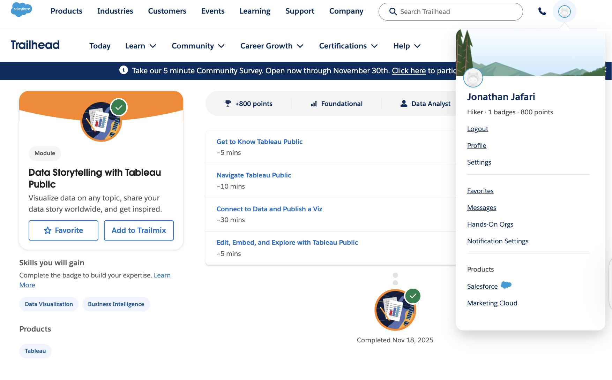
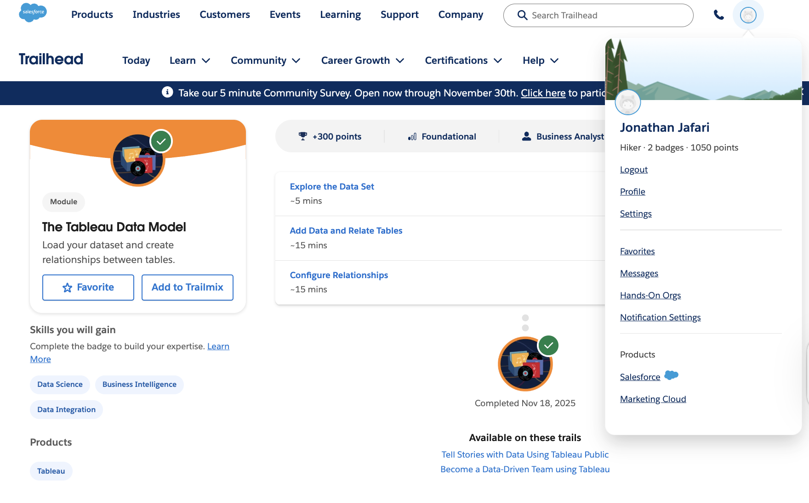
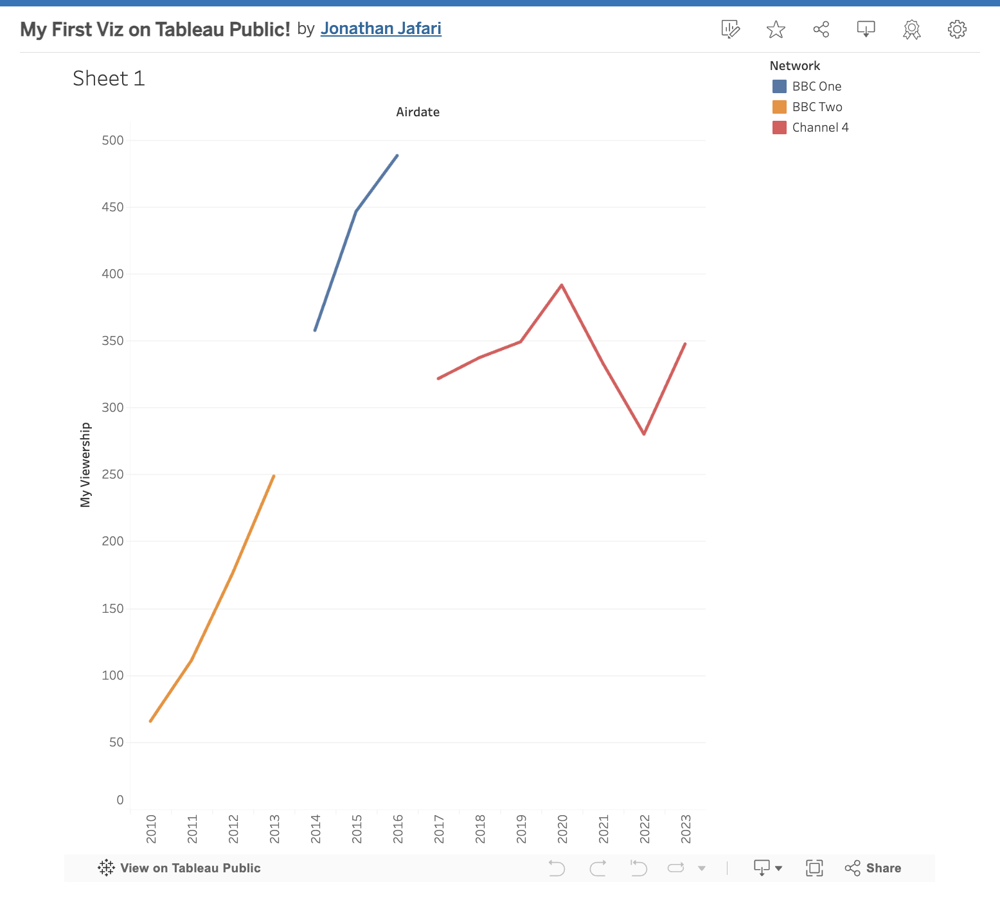

# Tableau Trailhead Basics

This repository contains the required deliverables for the Tableau Trailhead modules and Tableau Public visualization assignment for HHA 507.

---

## 📸 Evidence of Module Completion

### 1. Data Storytelling with Tableau Public  

### 2. The Tableau Data Model  

---

## 📊 Tableau Public Visualization

### Screenshot  

### Public Viz URL  
👉 https://public.tableau.com/app/profile/jonathan.jafari/viz/MyFirstVizonTableauPublic_17634878035640/Sheet1

---

## ✏️ Reflection

An idea that resonated most with me in regards to Data Storytelling with Tableau Public was that you need to start your Viz with an explicit question and keep all other elements of the Viz directed toward telling that one story. I took that lesson to heart by creating a viz that clearly shows how viewership has changed over time by network (with the only use of color being to differentiate between BBC One, BBC Two, and Channel 4) and making it easy to see the trend over time. The two concepts from The Tableau Data Model module that I thought were particularly relevant to my work were relationships versus joins; I found that relationships are beneficial as they allow many different tables to remain separate while only linking those tables when necessary for the analysis; as such, relationships reduce duplication and prevent row inflation when there are many tables to link. This concept is critical in the health care world as well since in the case of relating multiple tables (e.g., encounters, diagnoses, and lab results), if you join all of the tables into one large table, you could easily skew the number of patients or encounters. The combination of Tableau's data model and visual storytelling tools makes it very well-suited to create dashboards that track patient outcomes or readmission rates across multiple clinical tables and provide a clear picture to clinicians and administrators.

